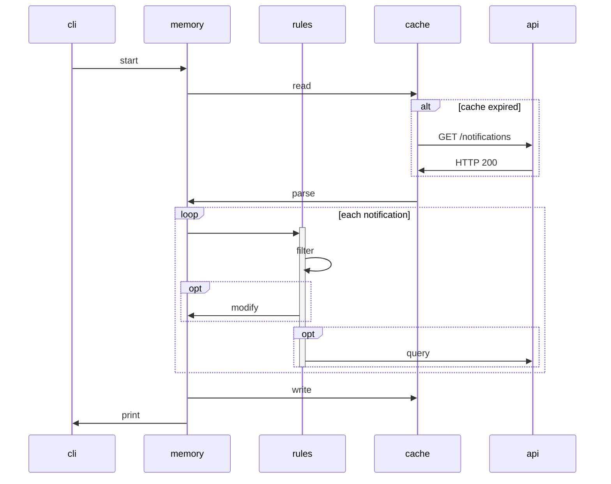

# gh-not
GitHub notifications managements, better

> TBD: here some documentation

```mermaid

sequenceDiagram

participant cli
participant memory
participant rules
participant cache
participant api

cli ->> memory: start
memory ->> cache: read

alt cache expired
    cache ->> api: GET /notifications
    api ->> cache: HTTP 200
end

cache ->> memory: parse

loop each notification
  activate rules
  memory ->> rules: 
  rules ->> rules: filter
  opt
    rules ->> memory: modify
  end
  opt
    rules ->> api: query
  end
  deactivate rules
end

memory ->> cache: write
memory ->> cli: print
```
